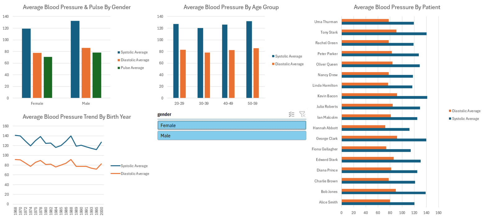

# Blood Pressure Analysis Dashboard

A comprehensive healthcare analytics dashboard built **entirely in Microsoft Excel and Power Query**, showcasing advanced data preparation, modeling, pivot table aggregation, and interactive visualization techniques.

---

---

## 📊 Project Overview
This project transforms raw patient data into actionable health insights through an executive-level dashboard. Built without external scripting languages, it highlights the robust capabilities of native Excel and Power Query workflows for end-to-end data cleaning, transformation, and dynamic reporting.

---

## 🛠️ Key Technical Features

### 1. Data Transformation & Pipeline (Power Query)
* **Data Ingestion & Connection:** Linked and managed local CSV data sources cleanly within Power Query, updating source file paths dynamically when files were relocated.
* **Data Hygiene:** Maintained strict data integrity standards by discarding incomplete rows with missing sensor readings rather than utilizing estimated or fabricated values.
* **Text Manipulation:** Utilized custom Power Query column transformations to seamlessly concatenate `first_name` and `last_name` into a unified `full_name` field for clean, natural categorical chart axes.

### 2. Data Modeling & Aggregation
* **Structured Relationships:** Connected patient data and reading tables efficiently within Excel's data architecture.
* **Multi-Dimensional PivotTables:** Built structured aggregation models to analyze vital health metrics across key categories:
  * Gender-based comparisons
  * Age bracket categorizations
  * Yearly and temporal trends
  * Individual patient profiles (Systolic & Diastolic averages)

### 3. Interactive Executive Dashboard
* **Dynamic Visualizations:** Features custom-formatted PivotCharts—including a horizontal bar chart for individual patient comparisons (utilizing the combined full names), line charts for temporal trends, and demographic breakdowns.
* **Chart Polish & UX:** Cleaned up visual presentation by hiding redundant chart field buttons, adding clear descriptive titles, and organizing the workbook into dedicated sheets (`Dashboard` and `pivot_tables`) for an intuitive user experience.
* **Interactive Slicers:** Integrated global Slicers linked across all underlying PivotTables and PivotCharts via Report Connections, enabling instantaneous, synchronized filtering across the entire dashboard view.

---

## 📁 Repository Structure

* `blood_pressure_analysis/` — Main project root directory
    * `data/` — Folder containing the active source CSV data files
        * `users.csv` — Patient demographic and identification records
        * `br_readings.csv` — Raw blood pressure sensor readings and timestamps
    * `users.txt` — Original source text file for patient records
    * `bp_readings.txt` — Original source text file for blood pressure readings
    * `blood_pressure_analysis.xlsx` — Final Excel workbook featuring Power Query ETL pipelines, data models, and the executive Dashboard
    * `README.md` — Comprehensive project documentation

---

## 🚀 How to Explore
1. Clone or download this repository to your local machine.
2. Open `blood_pressure_analysis.xlsx` in Microsoft Excel.
3. Navigate to the **Dashboard** tab to interact with the slicer, toggle filters, and explore the visual insights.
4. *(Optional)* Open Power Query via **Data > Queries & Connections** to inspect the underlying data transformation and ETL steps.
